# Spawning
Fishes in the mod has different spawning conditions. Depends on biomes or day-night cycle, etc.

And it has a 10% chance to spawn in trophy size (can be configured), just like in the Sea of Thieves.

_[Return to Main Page](wiki.md)_

## Splashtails
Can be found in the ocean biomes.

* Ruby:  _Always_
* Sunny:  _Day Time_
* Indigo:  _Always_
* Umber:  _10% Chance_
* Seafoam:  _Night Time & See Sky_

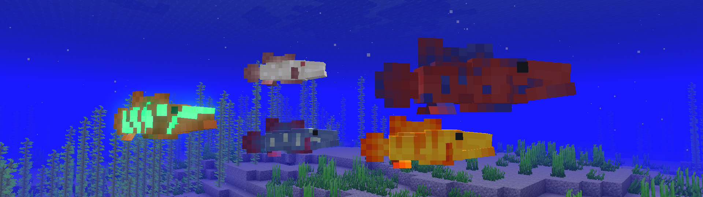

## Pondies
Can be found in the river and forest biomes.

* Charcoal:  _Always_
* Orchid:  _Always_
* Bronze:  _Always_
* Bright:  _10% Chance & Day Time_
* Moonsky:  _Night Time & See Sky_

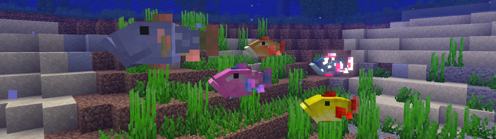

## Islehoppers
Some variant can be found around island coast using new 1.18 terrain system. Specific biomes or around the blocks.

* Stone:  _Beach Coast_
* Moss:  _Jungle Biomes, Swamp and Lush Caves_
* Honey:  _Bee Nest/Beehive with honey filled within 5 blocks_
* Raven:  _10% Chance & In the deep cave_
* Amethyst:  _Around Amethyst Geode, Minimum 16 blocks_

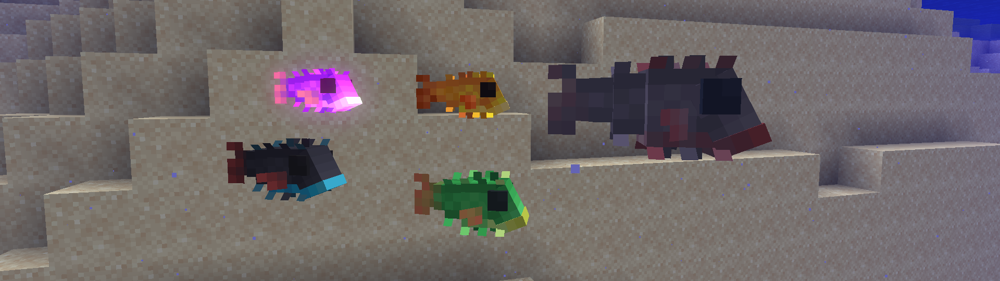

## Ancientscales
Can be found in the lukewarm ocean biomes or the ocean ruins.

* Almond:  _Always_
* Sapphire:  _Always_
* Smoke:  _Always_
* Bone:  _10% Chance & Inside Mineshaft and Stronghold if it flooded_
* Starshine:  _Night Time & See Sky & Moon Phase third quarter to first quarter_

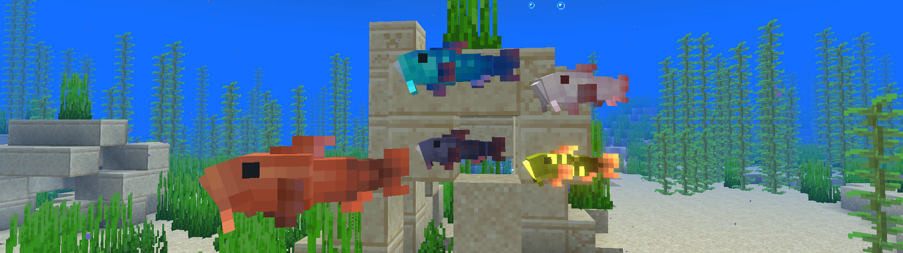

## Plentifins
Can be found in the warm/lukewarm ocean biomes. Bonedust often found in Mineshaft/Stronghold.

* Olive:  _Always_
* Amber:  _Dawn or Dusk & Not raining_
* Cloudy:  _Raining & See Sky_
* Bonedust:  _10% Chance or Inside Mineshaft and Stronghold if it flooded_
* Watery:  _Night Time & See Sky_

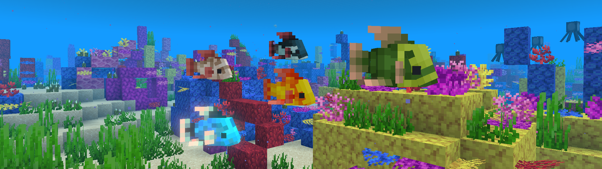

## Wildsplashes
Can be found in the warm ocean and lush caves biomes. Some are in specific biomes or around the blocks.

* Russet:  _Always_
* Sandy:  _Beach Coast_
* Ocean:  _Ocean Biomes_
* Muddy:  _10% Chance & In Swamp Biomes_
* Coral:  _Night Time & See Sky & In Warm Ocean & Around Coral Reef minimum 24 blocks_

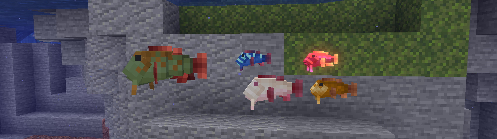

## Devilfishes
Can be found in the deep caves.

* Ashen:  _Always_
* Seashell:  _Always_
* Lava:  _Around Lava within 4 blocks_
* Forsaken:  _10% Chance_
* Firelight:  _Night Time & Around Lava/Magma Block within 4 blocks_

#### Behaviors
* Attack undead mobs

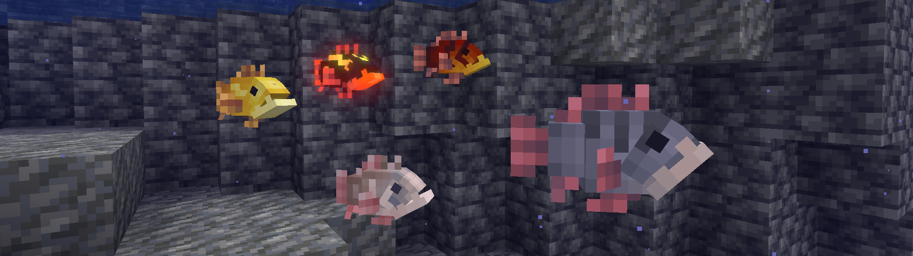

## Battlegills
Can be found in the Pillager Outpost/Ocean Monument and during raids

* Jade:  _Always_
* Sky:  _See Sky_
* Rum:  _Always_
* Sand:  _10% Chance & In Warm/Lukewarm Ocean biomes_
* Bittersweet:  _Night Time & See Sky_

#### Behaviors
* Attack undead mobs/Ocean hostile mobs

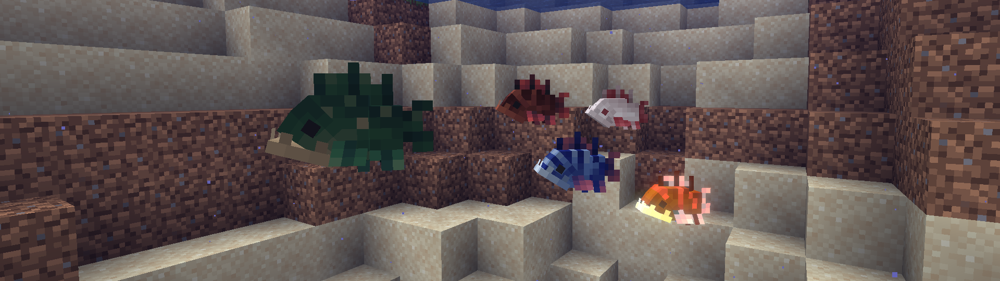

## Wreckers
Can be found only in the Shipwrecks.

* Rose:  _Always_
* Sun:  _Day Time & See Sky_
* Blackcloud:  _Thundering & See Sky_
* Snow:  _10% Chance & In Frozen Ocean biomes_
* Moon:  _Night Time & See Sky & Not New Moon_

#### Behaviors
* Attack mobs/players

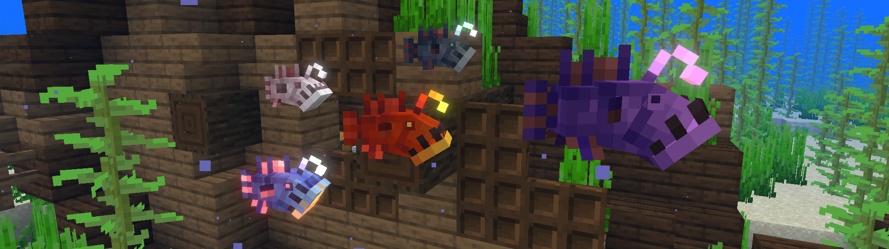

## Stormfishes
Can be found in the ocean biomes and during thunderstorm.

* Ancient:  _Always_
* Shores:  _Coast_
* Wild:  _Sparse Jungle_
* Shadow:  _10% Chance & Sky Light lower than or equals 4_
* Twilight:  _Night Time_

#### Behaviors
* Chance of lightning strikes if it swimming near the ocean surface
* Immune to Lightning Bolt

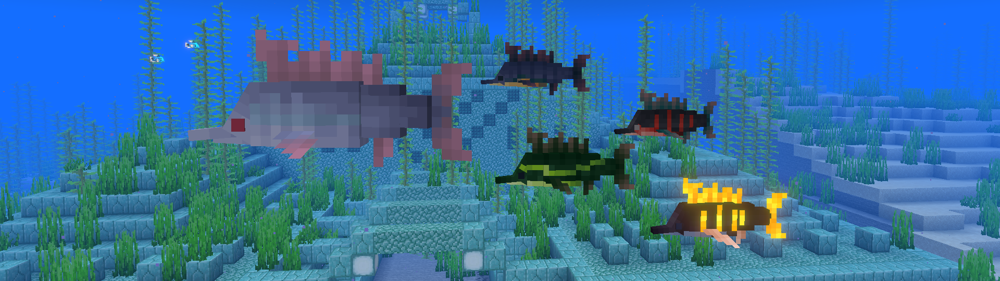

# Advancements
There are 7 advancements for people who love challenges to get all of them and 2 hidden advancements you might not know.
I won't spoil you much, have fun!

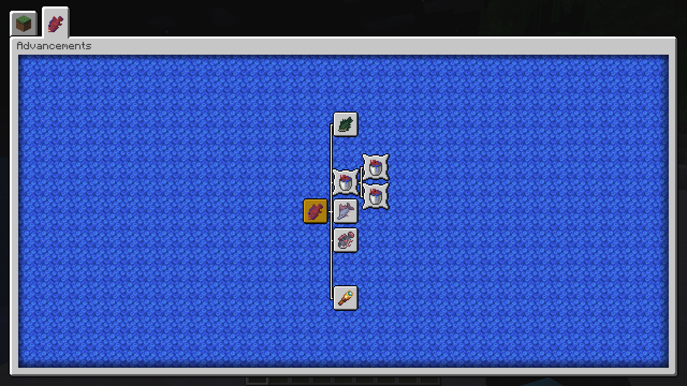

# Compatibility

- [Canvas Renderer](https://www.curseforge.com/minecraft/mc-mods/canvas-renderer) - Glowing layer for fishes