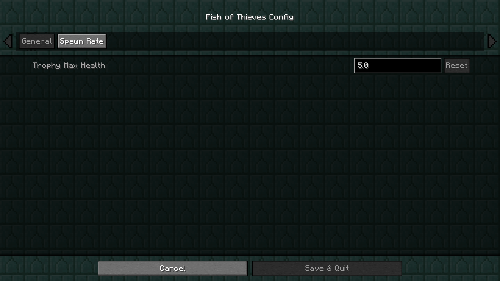
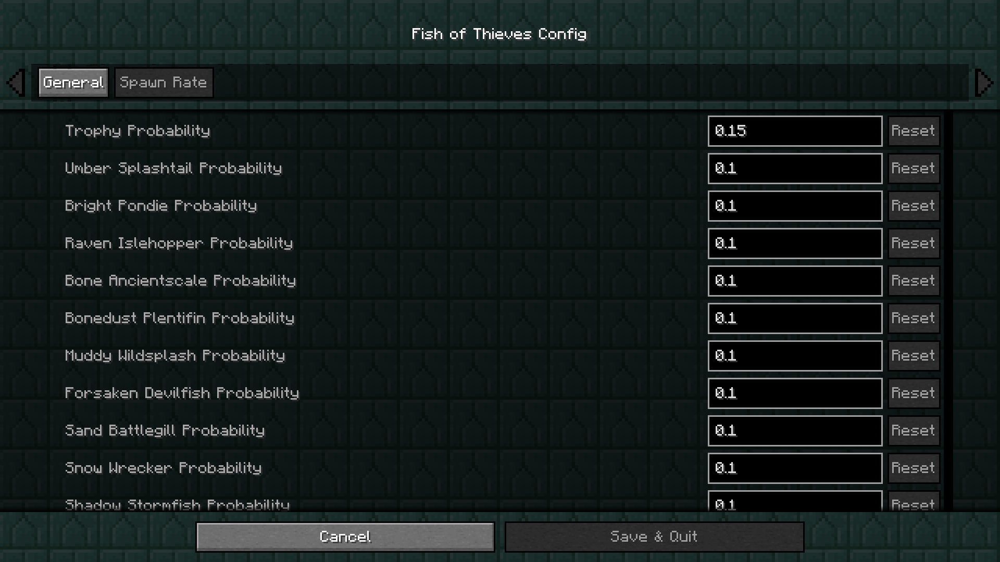

## Welcome to the Fish of Thieves wiki!

This mod is focused only adds all the fish from Sea of Thieves. It's adapted to Minecraft gameplay with different behavior and feature interactions.

Here you will find the information what fish can do. Where it spawns. And some advancements included!

## Download
* [Curseforge](https://www.curseforge.com/minecraft/mc-mods/fish-of-thieves)
* [Modrinth](https://modrinth.com/mod/fish-of-thieves)

## Pages
* [Mod Information](info.md)

## Configurations
Currently, We only have Trophy Max Health and rare variants probability configs.

